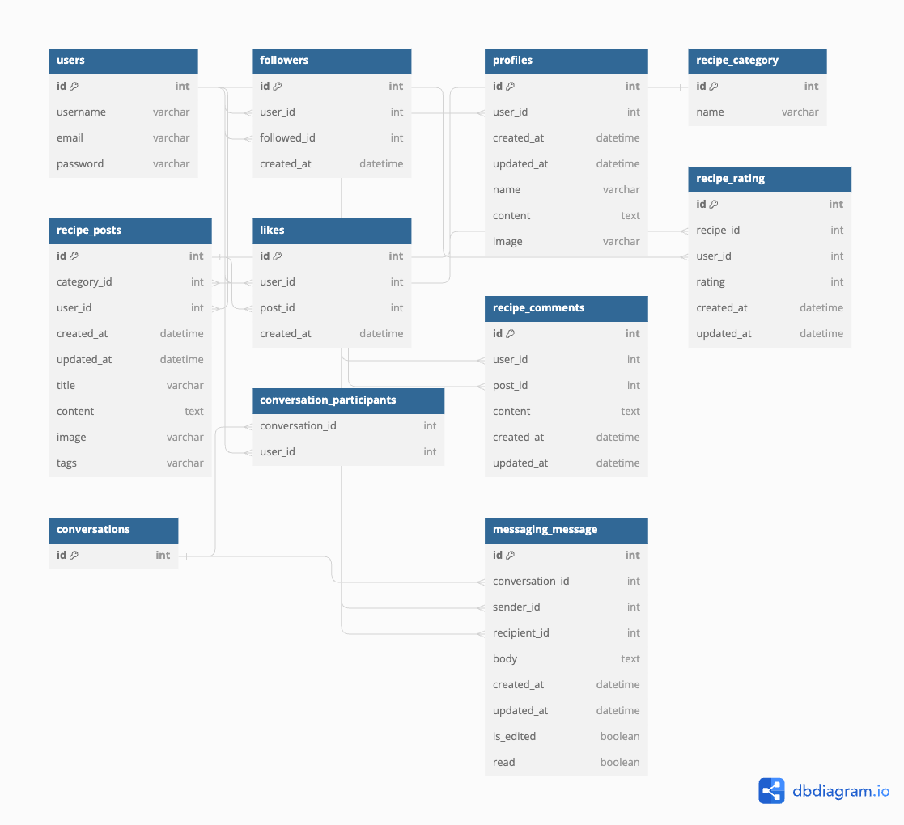

# iRecipe API

## Project goals

#### The primary goal of this project is to create a comprehensive platform that enables users to share, discover, and engage with a wide variety of recipes from around the world. By leveraging a robust backend built with Django and a PostgreSQL database hosted on ElephantSQL, the platform aims to offer a rich user experience through the following key features:

#### Recipe Management
1) Share Recipes: Users can post their recipes, including details such as title, content, category, tags for cuisine types, and images.
2) Discover Recipes: A searchable and filterable list of recipes allows users to discover new dishes based on categories, tags, and ratings.
#### User Interaction
3) Follow System: Users can follow other users to keep up with their recipe posts, creating a personalized feed of content.
4) Likes and Comments: Enhance engagement by allowing users to like recipes and comment on them, fostering a community of culinary enthusiasts.
#### Messaging and Notifications
5) Direct Messaging: A messaging system enables users to have private conversations, facilitating direct communication within the community.
6) Notifications: Users receive notifications for interactions such as new followers, likes, comments, and messages, ensuring they stay informed and engaged.
#### Ratings and Reviews
7) Recipe Ratings: Users can rate recipes on a scale of 1 to 5, allowing the community to identify highly appreciated dishes.
8) Feedback System: Through comments and ratings, users can provide valuable feedback to recipe authors, promoting improvement and variation.
#### Profiles and Customization
9) User Profiles: Detailed user profiles showcasing their recipes, likes, and followers, with the ability to customize their profile information and image.
10) Recipe Customization: Authors can edit their recipes, update content, and modify tags to keep their posts current and relevant.

## Agile Development

1) Initial Planning and Vision Setting
Project Goals: The project commenced with defining clear, achievable goals to guide development and ensure alignment with the project's vision.
Feature Brainstorming: A comprehensive list of desired features and enhancements for the platform was created, encompassing areas such as recipe management, user interactions, and profiles.
2) Backlog Creation and Prioritization
Backlog Development: A product backlog was developed, listing all envisioned features, enhancements, and bug fixes. This served as a dynamic to-do list for the project.
Prioritization: Items in the backlog were prioritized based on their perceived value to users, implementation complexity, and necessity for foundational functionality.
3) Iterative Development Cycles
Sprint Planning: As a solo developer, "sprints" were adapted to focus periods of development, typically spanning one to two weeks, during which specific backlog items were targeted for completion.
Self-assignment: Tasks were selected from the top of the prioritized backlog for each development cycle, ensuring that work focused on the most valuable features first.
4) Development and Continuous Review
Focused Work: During each cycle, development focused on completing the selected tasks, with a flexible approach to adjusting work based on challenges encountered.
Regular Self-reviews: At the end of each development cycle, a review was conducted to assess progress, evaluate the completed work, and gather self-feedback on the product's evolving state.
5) Testing and Refinement
Ongoing Testing: Continuous testing, including unit and integration tests, was integrated into the development process to ensure high quality and functionality of the platform.
6) Reflection and Adaptation
Retrospective Analysis: After each development cycle, a retrospective analysis was conducted to identify what went well, what challenges were faced, and what could be improved in future cycles.
Backlog Adjustment: The product backlog was regularly updated based on retrospective insights and any new ideas or requirements that emerged, ensuring the project remained aligned with goals and user needs.

### User stories backlog

#### Iteration 1 (Must have) (MVP)

#### Security and Account Management: Password Change API
- As a back-end service, I can facilitate password changes so that users can maintain the security of their accounts. (Must have) (MVP)
#### Authentication and User Management: User Registration
- As a back-end service, I can register new users so that users can become platform members.
Authentication and User Management: User Authentication API. (Must have) (MVP)
#### Authentication and User Management: User Authentication API
- As a back-end service, I can authenticate users so that they can sign in and access platform functionalities. (Must have) (MVP)
#### Authentication and User Management: User Profile API
- As a back-end service, I can manage user profiles, including editing and updating profiles, so that users can have an identity on the platform. (Must have) (MVP)

#### Iteration 2

#### Recipe Management and Interaction: Recipe Image Upload API
- As a back-end service, I can support uploading and managing images for recipes so that users can illustrate their posts. (Must have) (MVP)
#### Recipe Management and Interaction: Recipe Post API
- As a back-end service, I can handle creating, reading, updating, and deleting (CRUD) recipe posts so that users can share, view, and manage their recipes. (Must have) (MVP)

#### Iteration 3

#### Recipe Management and Interaction: Recipe Comment API 
- As a back-end service, I can manage comments on recipes, including posting, editing, and deleting comments, so that users can interact with recipes. (Must have)

#### Iteration 4

#### Like API
- As a back end service, I can create, retrieve, and delete a like so that users can access liked recipes, like a recipe, and delete a given like. (Must have)
#### Social Interaction: Follow System API
- As a back-end service, I can manage follow relationships between users so that users can follow other profiles and keep up with their posts. (Must have)

#### Iteration 5

#### Content Discovery and Management: Search API
- As a back-end service, I can provide search functionality so that users can easily find specific content. (Must have)
#### Content Discovery and Management: Recipe Sorting and Filtering API
- As a back-end service, I can offer sorting and filtering options for recipes, such as by most recent or highest rated, so that users can find recipes according to their preferences. (Must have)
#### Social Interaction: Popular Profiles API
- As a back-end service, I can provide a list of popular profiles based on certain criteria (like number of followers) so that users can discover prominent members. (Must have)

#### Iteration 6

#### Recipe Management and Interaction: Recipe Rating API
- As a back-end service, I can manage ratings for recipes so that users can rate and find the most delicious recipes. (Should have)
#### User Message API
- As a backend developer, I can build API endpoints to handle sending, receiving, and listing messages between users, so that the platform supports private user-to-user communication, fostering a vibrant and interactive community within the app. (Should have)
#### Recipe category API
- As a backend developer, I can implement API endpoints to create, retrieve, update, and delete recipe categories, so that the frontend can offer users a categorized view and management of recipes, enhancing the app's organization and user experience. (Should have)

#### Iteration 7

### Data Model Design
The structure of the data models was developed concurrently with the API endpoints, utilizing an entity-relationship diagram for planning.

### Users
- Represents registered individuals on the platform, capable of creating recipes, interacting with posts, and engaging in conversations.

#### Relationships:

- Direct: This model does not extend any relationships but is referenced by others.

#### Fields:
- id: Primary key.
username: A unique identifier chosen by the user.
email: The user's email address for contact and notifications.
password: A hashed password for secure authentication.
Functionality: Serves as the core identity model for authentication, authorship, and activity tracking across the platform.

#### Example Usage: 
- During registration, a new Users instance is created, capturing the username, email, and hashed password. This user can then author recipe posts, follow other users, and participate in the platform's social features.

### Followers
- Tracks the relationships where users follow each other to see updates and recipes, fostering a community atmosphere.

#### Relationships:

- Many-to-One with Users: Each follow relationship links two users - one as the follower (user_id) and the other as the followed (followed_id).

#### Fields:
id: Primary key.
user_id: The user who follows another.
followed_id: The user being followed. This field allows null values to enable future features like public figure pages that aren't user accounts.
created_at: The timestamp when the follow action occurred.
Functionality: Enables the social networking aspect of the platform, allowing users to curate their feed based on whom they follow.

#### Example Usage: 
- When a user decides to follow another, a Followers instance is created linking the two, enabling the follower to receive updates and posts from the followed user.

### Profiles
- Provides extended information about users, including display names, bios, and profile images, enriching the user experience.

#### Relationships:

- One-to-One with Users: Each profile is directly linked to a single user account, ensuring a one-to-one correspondence.
Fields:

id: Primary key.
user_id: The user account associated with this profile.
created_at & updated_at: Timestamps tracking when the profile was created and last updated.
name: The display name of the user, which can be different from their username.
content: A bio or description provided by the user.
image: A link to the user's profile image.
Functionality: Enhances user identity on the platform by allowing personalized profiles beyond the basic authentication model.

#### Example Usage: 
- Upon user registration, a Profiles instance is automatically created. Users can then customize their profile, adding personal touches like a bio and profile picture.

### Categories
- Organizes recipes into various predefined categories, aiding in content discovery and organization.

#### Relationships:

- One-to-Many with RecipePosts: A category can be associated with many recipe posts, but each post can belong to only one category.

#### Fields:
id: Primary key.
name: The name of the category, unique across the platform to prevent duplicates.
Functionality: Acts as a primary method for users to categorize their recipes, making it easier for others to discover content based on interests or dietary preferences.

#### Example Usage:
- When creating or editing a recipe post, users select a category from a dropdown menu populated with instances from the Categories model, effectively categorizing their recipe for easier search and filtration.

#### RecipePosts
- Central to the platform, this model stores detailed information about each recipe post, including its content, author, associated category, and tags that further categorize the recipe based on cuisine type, dietary preferences, and more.

#### Relationships:
Many-to-One with the User Model: Links each post to its author, allowing users to identify who created the recipe and explore other recipes by the same author.
Many-to-One with the Category Model: Associates each post with a specific category, facilitating easier discovery of recipes within particular culinary genres or types. This relationship is denoted by the related_name='recipe_posts' in the Category model, allowing easy access from a category instance to all associated recipe posts.
Fields:

id: The primary key of the recipe post.
category: A ForeignKey linking to the Category model, which may be null to accommodate posts that are not categorized. This flexibility allows authors to post recipes without needing to fit them into predefined categories.
user: A ForeignKey linking to the User model, identifying the author of the recipe post.
created_at: A DateTimeField that automatically sets the date and time when the recipe post is created, providing a timestamp for the post's publication.
updated_at: A DateTimeField that automatically updates every time the recipe post is saved, offering a timestamp for the most recent update to the post.
title: A CharField that stores the title of the recipe, providing a succinct and descriptive headline for the post.
content: A TextField for the detailed recipe instructions and ingredients, allowing authors to provide comprehensive cooking guidance.
image: An ImageField for an optional visual representation of the finished dish, enhancing the post's appeal and providing visual instructions.
tags: A CharField with predefined choices, allowing authors to tag their recipes with specific attributes like "Vegan," "Gluten-Free," or "Quick Meals," enhancing discoverability and filtering.
Functionality: Acts as the backbone of content creation on the platform, enabling users to share their culinary creations. Authors can provide rich descriptions, categorize their recipes, and include images and tags for a comprehensive presentation.

#### Example Usage: 
- When a user submits a new recipe, a RecipePosts instance is created with all the provided details, including category, title, content, and optional tags and image. This post then becomes accessible to other users, who can browse, like, comment on, and rate the recipe based on its attributes and content. The categorization and tagging system facilitate targeted searches, allowing users to find recipes that match their specific interests or dietary needs.

#### Likes
Represents the user's approval or appreciation for a specific recipe post, enhancing user engagement and interaction on the platform.

#### Relationships:

Many-to-One with Users: Each like is linked to a specific user, indicating who liked the post.
Many-to-One with RecipePosts: Each like is also linked to a specific recipe post, indicating which post was liked.

#### Fields:
id: The primary key for the like entry.
user_id: References the user who liked the post.
post_id: References the recipe post that received the like.
created_at: Timestamp for when the like was made, providing insights into user engagement over time.
Functionality: Likes serve as a simple yet powerful way for users to engage with content, contributing to the visibility and popularity of recipes on the platform.

#### Example Usage:
- When a user likes a recipe post, a new Likes instance is created, linking the user to the post. This action can influence the post's ranking and visibility, encouraging more user interaction.

### RecipeComments
Facilitates discussions and feedback on recipe posts, allowing users to share their experiences, tips, or questions related to the recipe.

#### Relationships:
Many-to-One with Users: Links the comment to its author.
Many-to-One with RecipePosts: Associates the comment with a specific recipe post.

#### Fields:
id: Primary key.
user_id: Identifier for the user who made the comment.
post_id: Identifier for the recipe post the comment is related to.
content: The textual content of the comment.
created_at: Timestamp marking when the comment was posted.
updated_at: Timestamp marking the last update to the comment, supporting edit functionality.
Functionality: Enhances community interaction on the platform by allowing users to communicate directly on recipe posts.

#### Example Usage: 
Users can post comments on a recipe to ask questions, provide feedback, or share their cooking experiences, which are stored as RecipeComments instances.

### RecipeRating
Allows users to rate recipes, providing feedback on the quality or preference, which can help others in deciding which recipes to try.

#### Relationships:
Many-to-One with RecipePosts: Each rating is associated with a specific recipe post.
Many-to-One with Users: Each rating is made by a specific user.

#### Fields:
id: Primary key.
recipe_id: References the rated recipe post.
user_id: References the user who provided the rating.
rating: An integer value representing the user's rating of the recipe.
created_at: Timestamp for when the rating was made.
updated_at: Timestamp for any updates to the rating, allowing users to change their rating over time.
Functionality: Provides a mechanism for users to express their satisfaction with recipes, influencing the recipe's overall rating and helping to guide other users.

#### Example Usage:
- A user who tries a recipe can rate it, creating a RecipeRating instance that contributes to the recipe's overall score, guiding future users.

### MessagingMessage
Stores individual messages within a conversation, facilitating direct communication between users.

#### Relationships:
Many-to-One with Conversations: Each message belongs to a conversation.
Many-to-One with Users (sender and recipient): Identifies the sender and recipient of the message.

#### Fields:
id: Primary key.
conversation_id: Links the message to its conversation.
sender_id: The user sending the message.
recipient_id: The intended recipient of the message.
body: The content of the message.
created_at: When the message was sent.
updated_at: When the message was last edited, if applicable.
is_edited: Indicates if the message has been edited.
read: Indicates if the message has been read by the recipient.
Functionality: Enables real-time communication between users, enriching the social features of the platform.

Example Usage: Users can send messages to each other about recipes or general inquiries. Each sent message creates a MessagingMessage instance within a conversation.

### Conversations
Represents a thread of messages between users, facilitating direct communication within the platform.

#### Relationships:
Many-to-Many with Users through ConversationParticipants: Establishes which users are participants in the conversation. This relationship allows for group conversations with multiple participants and is managed through the ConversationParticipants intermediary table.

#### Fields:
id: Primary key for each conversation.
Functionality: Serves as the container for messages exchanged between two or more users, grouping them into a coherent thread. Each Conversation instance can represent either a one-on-one chat or a group chat, depending on the number of participants.

#### Example Usage:
- When users initiate a new direct message thread or group chat, a Conversations instance is created. Messages sent within this thread are associated with the conversation, allowing participants to view the entire message history.

#### ConversationParticipants
Manages the many-to-many relationship between Conversations and Users, indicating which users are part of which conversations.

### Relationships:
Many-to-One with Conversations: Links participants to a specific conversation.
Many-to-One with Users: Identifies the user involved in the conversation.

#### Fields:
conversation_id: References the Conversations table, indicating the conversation to which the user is a participant.
user_id: References the Users table, indicating the user participating in the conversation.
Functionality: This intermediary model is crucial for supporting multi-user chat functionalities, allowing for dynamic participation where users can be added to or removed from conversations.

#### Example Usage:
- When a new user is added to an existing conversation, or when a new group chat is formed, ConversationParticipants entries are created for each participating user. This mechanism enables flexible conversation management, including adding new participants to ongoing conversations.

### DB diagram

    

## API Endpoints for i_recipe_api

| **URL** | **Notes** | **HTTP Method** | **CRUD operation** | **View type** | **POST/PUT data format** |
|---------|-----------|-----------------|--------------------|---------------|-------------------------|
| **User Account Endpoints** | | | | | |
| `/users/register` | Registers a new user account, creating an associated profile. | POST | Create | List | `{ "username": "string", "email": "string", "password": "string" }` |
| `/users/login` | Authenticates a user and returns a token. | POST | Read | Detail | `{ "username": "string", "password": "string" }` |
| `/users/{id}` | Retrieves, updates, or deletes user account details. | GET, PUT, DELETE | Read, Update, Delete | Detail | For PUT: `{ "email": "string", "password": "string" }` |
| **Profile Endpoints** | | | | | |
| `/profiles/{id}` | Retrieves or updates a user's profile information. | GET, PUT | Read, Update | Detail | For PUT: `{ "name": "string", "content": "string", "image": "file" }` |
| **Recipe Management Endpoints** | | | | | |
| `/recipe_posts/` | Lists all recipes or creates a new one. | GET, POST | Read, Create | List | For POST: `{ "title": "string", "content": "string", "category_id": int, "tags": "[string]", "image": "file" }` |
| `/recipe_posts/{id}` | Retrieves, updates, or deletes a specific recipe post. | GET, PUT, DELETE | Read, Update, Delete | Detail | For PUT: `{ "title": "string", "content": "string", "category_id": int, "tags": "[string]", "image": "file" }` |
| **Social Interaction Endpoints** | | | | | |
| `/likes/` | Likes a recipe post or lists all likes. | POST, GET | Create, Read | List | For POST: `{ "post_id": int }` |
| `/likes/{id}` | Unlikes a specific recipe post. | DELETE | Delete | Detail | N/A |
| `/recipe_comments/` | Lists all comments or adds a new comment on a recipe post. | GET, POST | Read, Create | List | For POST: `{ "post_id": int, "content": "string" }` |
| `/recipe_comments/{id}` | Retrieves, updates, or deletes a specific comment. | GET, PUT, DELETE | Read, Update, Delete | Detail | For PUT: `{ "content": "string" }` |
| `/followers/` | Follows a user or lists all follow relationships. | POST, GET | Create, Read | List | For POST: `{ "followed_id": int }` |
| `/followers/{id}` | Unfollows a specific user. | DELETE | Delete | Detail | N/A |
| **Rating Endpoints** | | | | | |
| `/recipe_rating/` | Rates a recipe or lists all ratings. | POST, GET | Create, Read | List | For POST: `{ "recipe_id": int, "rating": int }` |
| `/recipe_rating/{id}` | Updates or deletes a specific rating. | PUT, DELETE | Update, Delete | Detail | For PUT: `{ "rating": int }` |
| **Messaging Endpoints** | | | | | |
| `/conversations/` | Starts or lists conversations. | POST, GET | Create, Read | List | For POST: `{ "participant_ids": [int] }` |
| `/conversations/{id}` | Retrieves conversation details including messages. | GET | Read | Detail | N/A |
| `/messaging_message/` | Sends a message within a conversation. | POST | Create | List | `{ "conversation_id": int, "body": "string" }` |
| `/messaging_message/{id}` | Retrieves, updates, or deletes a specific message. | GET, PUT, DELETE | Read, Update, Delete | Detail | For PUT: `{ "body": "string", "read": boolean }` |

### Frameworks
- Django 3.2.22: A high-level Python Web framework that encourages rapid development and clean, pragmatic design.
Django REST Framework 3.14.0: A powerful and flexible toolkit for building Web APIs in Django.

- Authentication and Authorization
django-allauth 0.44.0: Provides authentication mechanisms, including social authentication, for Django projects.

- dj-rest-auth 2.1.9: A RESTful API for authentication in Django, integrating with django-allauth for social auth endpoints.
djangorestframework-simplejwt 5.3.1: JSON Web Token authentication for Django REST Framework.

- oauthlib 3.2.2: A generic, spec-compliant, thorough implementation of the OAuth request-signing logic.

- PyJWT 2.8.0: A Python library that allows you to encode and decode JSON Web Tokens (JWT).
Database and Storage.

- dj-database-url 0.5.0: Utility to help you load your database into your dictionary from the DATABASE_URL environment variable.
psycopg2 2.9.9: PostgreSQL database adapter for Python.

- cloudinary 1.36.0: Cloudinary Python SDK for easy image and video upload, transformations, and delivery.

- dj3-cloudinary-storage 0.0.6 and django-cloudinary-storage 0.3.0: Integrations for using Cloudinary with Django for static and media file storage.

#### Utilities and Helpers

- certifi 2023.7.22: Provides Mozilla's carefully curated collection of Root Certificates for validating the trustworthiness of SSL certificates.

- cffi 1.16.0 and cryptography 41.0.7: Libraries for cryptographic recipes and primitives in Python, with CFFI providing a foreign function interface.

- Pillow 10.1.0: The Python Imaging Library adds image processing capabilities.

- pycparser 2.21: C parser in Python, a dependency for other libraries to interface with C code.

- python3-openid 3.2.0: Python 3 port of the python-openid library for OpenID support.

- django-cors-headers 4.3.1: A Django application for handling the server headers required for Cross-Origin Resource Sharing (CORS).
- django-filter 23.5: A library for filtering querysets dynamically with a simple API.
Networking and Requests.

- requests 2.31.0 and requests-oauthlib 1.3.1: Elegant and simple HTTP libraries for Python, built for human beings. requests-oauthlib provides OAuth1 authentication to requests.
urllib3 2.0.7: A powerful HTTP client for Python. requests library uses urllib3 internally.
#### Miscellaneous
- asgiref 3.7.2: ASGI (Asynchronous Server Gateway Interface) specs, utilities, and adapters for Python asynchronous web servers and applications.
- charset-normalizer 3.3.0: A library for character set detection, ensuring text strings are properly encoded/decoded.
- defusedxml 0.7.1: XML parsing library that protects against various XML security issues.
distlib 0.3.7, filelock 3.12.4, packaging 23.2, platformdirs 3.11.0, pytz 2023.3.post1, six 1.16.0, sqlparse 0.4.4: Various utility libraries for package management, cross-platform compatibility, date and time zone operations, parsing, and compatibility shims.

#### Deployment
- gunicorn 21.2.0: A Python WSGI HTTP Server for UNIX, used for deploying Python web applications.

### iRecipe API Manual Testing

- Introduction
The iRecipe API serves as the backbone for a dynamic culinary platform, designed to foster a community of food enthusiasts, home cooks, and professional chefs. This comprehensive manual testing document outlines the methodologies employed to ensure the API functions seamlessly, facilitating recipe sharing, social interactions, and personalized user experiences.

- Methodology
A structured approach was adopted for testing each API endpoint, utilizing a diverse dataset encompassing various user personas with distinct roles and permissions. Users within the platform are segmented into different categories, including general users, recipe contributors, and administrators, each with varying levels of access and control over the content and interactions within the platform.

- Key user personas for testing included:

- Admins: 
Represented by admin1, admin2, etc., tasked with platform oversight, content moderation, and user management.

- General Users: Enthusiasts such as foodie1, foodie2, etc., engaging with the platform by browsing recipes, following other users, and participating in discussions.
The core functionalities tested encompassed:

- Recipe Management: 
Ensuring users can create, update, view, and delete recipes, with specific attention to permission handling based on user roles.
Social Features: Testing the ability of users to follow others, like recipes, comment on posts, and rate dishes, aiming for a socially engaging platform.
-Messaging System: 
Verifying that users can initiate conversations, send messages, and manage their inbox, fostering direct communication within the community.
- User Profiles and Permissions: 
Confirming that users can edit their profiles, manage their account settings, and that administrators have appropriate control over user accounts and content.

- Each endpoint was meticulously tested for both expected functionality and edge cases, ensuring robustness and reliability. Testing was conducted through the Django Rest Framework HTML interface on a dedicated test server, providing a direct and interactive way to simulate real-world usage scenarios.

- Testing Outcomes
The tests aimed to validate the following key aspects:

- Data Integrity and Security: 
Ensuring that user data is accurately processed and stored, with strict adherence to privacy and security standards.
Functionality Across User Roles: Verifying that the API correctly differentiates between user roles, granting or restricting access as appropriate.
- User Experience: 
Assessing the API's responsiveness, error handling, and overall usability to guarantee a smooth and enjoyable platform experience.

Note: 
- It's important to acknowledge that object IDs and specific data points may vary in the documentation compared to the live platform due to the dynamic nature of the testing environment, including object creation and deletion.

- This manual testing phase was crucial in identifying potential issues, fine-tuning the platform's functionalities, and ensuring that the iRecipe API stands ready to support a vibrant and engaging culinary community.