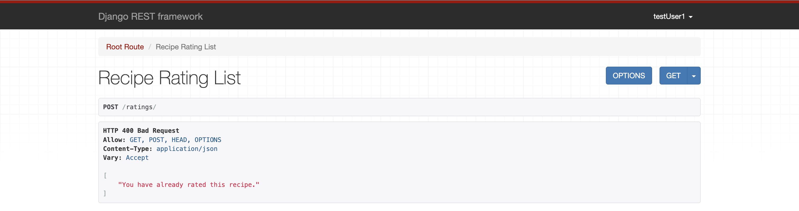

# i_recipe_api Manual Testing

A series of manual tests were made and will be described in this document. Each app and its functionality where tested and a print-screen image where taken to document each step.
Tests where performed using DRF HTML interface running on a test server.

## Authentication and Registration Tests

#### test 1
- when attempting to register and create a new profile:
- "testUser1" was created successfully.

**Result: PASS**

    

#### test 2
- when attempting to register with an existing username:
- Message: "A user with that username already exist" was displayed successfully.

**Result: PASS**

    

#### test 3
- When attempting to register and the password fields don't match:
- Message: "The two password fields didn't match".

**Result: PASS**

    

#### test 4
- When attempting to login new user:
- Login successful.

**Result: PASS**

    

#### test 5 
- When attempting to login with wrong credentials:
- message: "Unable to login with provided credentials".
- login failed.

**Result: PASS**

    

#### test 6
- When attempting to change the password:
- message: "new password has been saved"
- change password successful

**Result: PASS**

    

## Category

#### test 1

- When attempting to list all categories:
- list successful

**Result: PASS**

    

#### test 2

- when attempting to create a new category:
- category created successfully:

**Result: PASS**

    

#### test 3

- when attempting to perform create, update, delete without admin credentials:
- message: "you do not have permission to perform this action"
- credential restriction successful

**Result: PASS**

    

#### test 4

- when attempting to create a category with an existing name:
- message: "category with this name already exists"
- unique: True; "successful"

**Result: PASS**

    

#### test 5
- when attempting to update a category name:
- category name updated successfully:

**Result: PASS**

    

#### test 6 
- when attempting to delete an existing category:
- category deleted successfully:

**Result: PASS**

    

## Conversation

#### test 1
- When attempting to to list a conversation owned by the logged in sender or recipient:
- list successful

**Result: PASS**

    

**Result: PASS**

    

**Result: PASS**

    

#### test 2
- When user that does not own conversations, attempt to list: "users can only retrieve conversations owned by hin"
- list return null: successful

**Result: PASS**

    

#### test 3
- When attempt to retrieve conversation detail by id:
- detail retrieve: successful

**Result: PASS**

    

#### test 4
- When attempt to retrieve conversation detail not owned by logged in user:
- message: "you do not have permission to view this conversation"

**Result: PASS**

    

#### test 5
- When attempt to list or retrieve conversation detail not logged in:
- message: "authentication credentials were not provided"

**Result: PASS**

    

**Result: PASS**

    

## followers

#### test 1
- When attempting to list the followers list:
- list successful

**Result: PASS**

    

#### test 2
- When attempting to retrieve follower detail by id:
- deatail successful

**Result: PASS**

    

#### test 3
- When attempting to follow a profile:
- follow successful

**Result: PASS**

    

#### test 4
- When attempting to unfollow a profile:
- unfollow successful

**Result: PASS**

    

#### test 5
- when retrieve followers detail followed:null unfollow 'delete' option not present
- unfollow 'delete' option not present: successful

**Result: PASS**

    

## like

#### test 1
- When attempting to like a recipe:
- like successful

**Result: PASS**

    

#### test 2
- when attempting to unlike 'delete' a recipe:
- unlike successful

**Result: PASS**

    

#### test 3
- when not like owner 'no delete' unlike
- unlike 'delete' not present successful

**Result: PASS**

    

## messages

#### test 1
- when attempting to send a message:
- message sent: successful

**Result: PASS**

    

#### test 2
- When accessing message read status from: false to true:
- message read status: true successful

**Result: PASS**

    

#### test 3
- When answering a message:
- answer received: successful

**Result: PASS**

    

#### test 4
- When attempt to delete a message owned by logged in user:
- delete: successful

**Result: PASS**

    

#### test 5
- When attempt to retrieve message detail not owned by logged user:
- message:  "Message does not exist or you do not have permission to view it." successful

**Result: PASS**

    

#### test 6
- When attempt to list messages when logged in when a user had no messages
- message list: null successful

**Result: PASS**

    

#### test 7
- When attempting to update a message owned by the logged in user:
- update: successful

**Result: PASS**

    

## profile

#### test 1
- When attempting to list the profiles:
- profile lis successful

**Result: PASS**

    

#### test 2
- profile fields filed and posted:
_ filed fields posted successful

**Result: PASS**

    

**Result: PASS**

    

#### test 3
- When attempting to update profile info:
- update successful

**Result: PASS**

    

## rating

#### test 1
- When attempting to rate a recipe post:
- rating successful

**Result: PASS**

    

#### test 2
- When attempting to list the recipe rating:
- rating successful

**Result: PASS**

    

#### test 4
- Rating list average, integer or rounded to .5:
- successful

**Result: PASS**

    

#### test 5
- When attempting to delete a rating:
- rating deleted successful

**Result: PASS**

    

#### test 6
- when try to rate a recipe on the list view that is already rated:
- message: "you have already rated this recipe"

**Result: PASS**

    

#### test 7
- when attempt to update a recipe rating in the rating detail:
- update successful

**Result: PASS**

    

## comments

#### test 1
- when attempting to comment a recipe as a logged in user:
- comment post successful

**Result: PASS**

    

#### test 2
- when attempting to list all the comments:
- list successful

**Result: PASS**

    

#### test 3
- when attempt to update a comment that is owned by the logged in user:
- update successful

**Result: PASS**

    

#### teat 4
- When a user does not own a comment: Delete and update not available
- successful

**Result: PASS**

    

#### test 5
- When attempting to delete a comment owned by the logged user:
- delete successful

**Result: PASS**

    

## recipe post

#### test 1
- Recipe post fields are present:
- recipe post fields: successful

**Result: PASS**

    

#### test 2
- When attempting to post a new recipe as logged in user:
- recipe post successful

**Result: PASS**

    

#### test 3
- When attempting to update a post owned by the login user:
- update successful

**Result: PASS**

    

#### test 4
- When attempting to delete a post owned by the logged in user:
- delete successful

**Result: PASS**

    

#### test 5
- When attempting to post a recipe tag:
- recipe tag post successful

**Result: PASS**

    

#### test 6
- When attempting to retrieve a recipe post detail by id:
-  recipe post detail retrieve successful

**Result: PASS**

    

#### test 7
- Non authenticate users can retrieve and view recipe posts:
- successful

**Result: PASS**

    

#### test 8
- Delete and update recipe post are available to recipe posts owner only
- successful

**Result: PASS**

    

